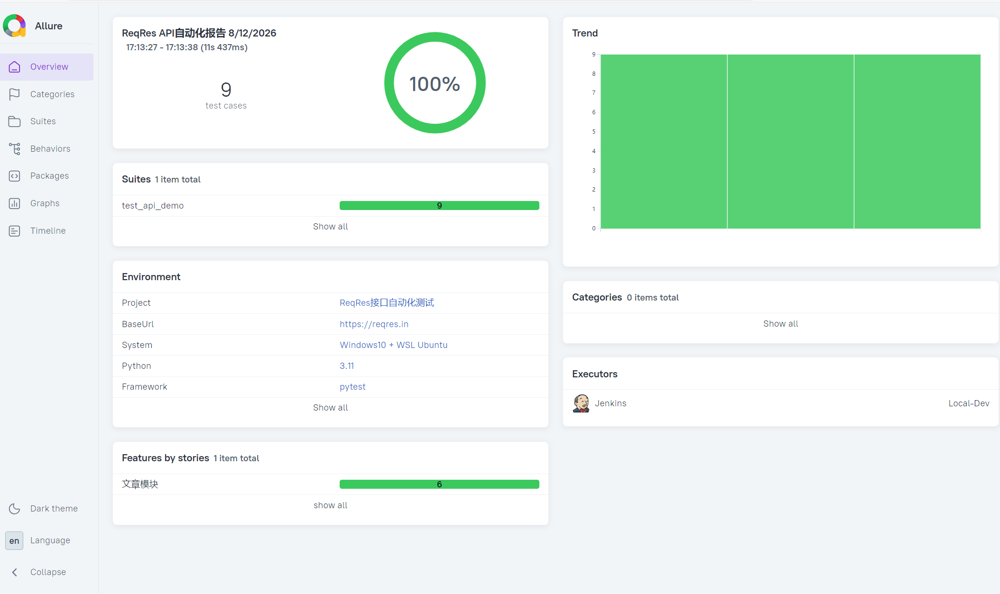
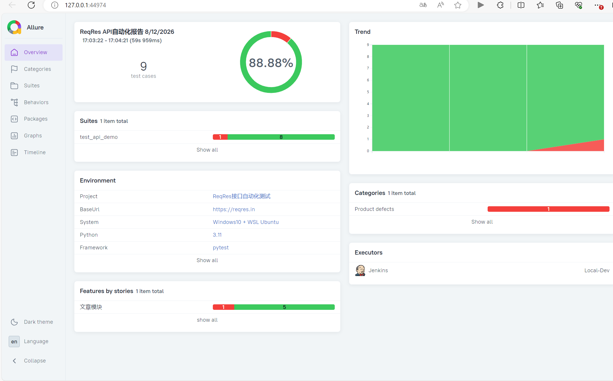

# ReqRes 接口自动化测试项目


> 基于 Pytest + Requests + Allure 搭建的接口自动化测试框架，针对 ReqRes 公开接口实现自动化回归测试，生成可视化测试报告。

## ✨ 项目亮点

- 封装公共请求方法，统一管理接口请求逻辑
- Pytest 管理测试用例，支持参数化、异常场景断言
- 集成 Allure 可视化测试报告，按模块分类展示
- **Allure Trend 趋势图监控多轮回归通过率变化**，支持质量波动追踪
- 可扩展接入 CI/CD 流水线（Jenkins / GitHub Actions）实现持续回归

## 🛠️ 技术栈

| 技术 | 说明 |
|------|------|
| Python 3 | 开发语言 |
| Pytest | 测试框架 |
| Requests | HTTP 接口请求库 |
| Allure | 可视化测试报告 |

## 📂 项目结构

reqres_api_test/
├── assets/                  # 报告截图
│   ├── allure_pass_100.png  # 全量通过报告
│   └── allure_trend_fail.png # Trend 趋势对比图
├── conftest.py              # pytest 公共配置
├── pytest.ini               # pytest 配置文件
├── requirements.txt         # 依赖包清单
└── test_api_demo.py         # 接口自动化测试用例


## ▶️ 本地运行

### 1. 克隆项目
```bash
git clone https://github.com/你的用户名/reqres-api-pytest-allure.git
cd reqres-api-pytest-allure
```

### 2. 安装依赖
```bash
pip install -r requirements.txt
```

### 3. 执行测试，生成 Allure 结果
```bash
pytest test_api_demo.py -v --alluredir=allure-results
```

### 4. 打开可视化报告
```bash
allure serve allure-results
```

## 📊 效果预览

### 全量回归通过（100% Passed）


### 多轮回归 Trend 趋势监控

> 前两轮全量通过，第三轮构造异常场景模拟缺陷，直观展示接口迭代质量波动


## 📌 测试范围

ReqRes 文章模块接口：

- GET 获取文章列表
- GET 获取单篇文章
- POST 新增文章
- PUT 修改文章
- DELETE 删除文章
- 参数化查询不同文章 ID

断言校验：HTTP 状态码、返回数据类型、关键字段存在性、数据长度

## 💡 拓展方向

- 接入 GitHub Actions / Jenkins，提交代码自动执行回归
- 设置通过率质量门禁，不达标阻断发布
- 增加数据库校验、接口关联场景
- 集成失败用例自动重跑机制
