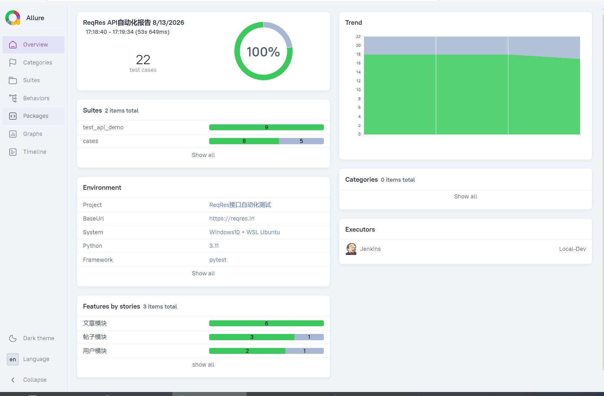

# ReqRes 接口自动化测试项目 

> 基于 Pytest + Requests + Allure 搭建**工程化数据驱动接口自动化测试框架**，针对公开 Mock 接口实现自动化回归测试，支持业务链路串行依赖、自动重试，产出可视化测试报告并接入 CI 持续集成。

## ✨ 项目亮点

- ✅ 统一 HTTP 请求封装，集成 tenacity 自动重试，解决公网 Mock 接口网络抖动问题
- ✅ 工程化分层设计：公共工具层、测试数据层、业务用例层解耦，易维护、易扩展
- ✅ YAML 数据驱动：接口地址、请求参数、预期断言全部外置，新增用例无需改动 Python 脚本
- ✅ Pytest Fixture 实现**上下游接口参数传递**，支持完整业务链路串行测试
- ✅ Allure 可视化报告：支持 Feature/Story 业务模块划分、环境变量、多轮执行 Trend 趋势图
- ✅ 接入 GitHub Actions CI，代码 Push 自动触发回归，持续左移接口质量校验
- ✅ 通用断言工具封装：状态码校验、JSON 字段等值断言、类型断言，复用性强
- ✅ 日志统一封装，便于定位接口失败根因

## 🛠️ 技术栈

| 技术 | 说明 |
|------|------|
| Python 3.11 | 开发语言 |
| Pytest | 测试框架，Fixture 实现业务链路依赖 |
| Requests | HTTP 接口请求库 |
| Tenacity | 失败自动重试，提升公网接口稳定性 |
| PyYAML | 读取 YAML 测试数据，实现数据驱动 |
| Allure | 可视化测试报告、趋势图、业务标签 |
| GitHub Actions | CI 流水线，提交自动执行回归 |

## 📂 项目结构
```text
reqres-api-pytest-allure/
├── assets/              # 报告截图（README 展示用）
├── cases/               # 业务用例目录
├── common/              # 公共工具层：请求封装、断言、日志、yaml、质量门禁、DB工具
├── config/              # 测试数据 yaml
├── reports/             # 报告输出目录
├── .github/workflows/   # GitHub Actions CI 配置
├── .gitignore
├── conftest.py          # pytest全局fixture钩子
├── pytest.ini           # pytest 全局配置
├── requirements.txt     # 依赖清单
├── test_api_data_driven.py # 数据驱动主用例 + 完整业务链路
├── test_api_demo.py     # 基础demo用例
├── test_user_flow.py    # 用户业务链路用例
└── README.md
```


## ▶️ 本地运行

### 1. 克隆项目
```bash
git clone https://github.com/StillStream-ink/reqres-api-pytest-allure.git
cd reqres-api-pytest-allure
```

### 2. 安装依赖
```bash
pip install -r requirements.txt
```

### 3. 执行测试，生成 Allure 结果
```bash
# 执行全部数据驱动用例（含业务链路）
pytest test_api_data_driven.py -v --alluredir=allure-results

```

### 4. 打开可视化报告
```bash
allure serve allure-results
```

## 📊 效果预览

### 全量回归通过（100% Passed）


### 多轮回归 Trend 趋势监控

> 前两轮全量通过，第三轮构造异常场景模拟缺陷，直观展示接口迭代质量波动


## 🎯 测试范围

ReqRes 文章模块接口：
- GET 获取文章列表
- GET 获取单篇文章
- POST 新增文章
- PUT 修改文章
- DELETE 删除文章
- 参数化查询不同文章 ID

✅ 断言能力：HTTP 状态码校验、返回值类型校验、关键字段等值断言、字段存在性校验

✅ **业务链路场景（Fixture 参数传递）**

说明：JSONPlaceholder 为只读 Mock 服务，POST 新增数据不会持久化保存，因此选用存量资源演示链路
> 串行链路：**查询文章 → 修改文章 → 删除文章**，上游接口产出 ID 传递给下游接口使用

## 💡 踩坑记录

1. JSONPlaceholder Mock 接口 POST 仅模拟成功，**不持久化数据**，直接新增后查询会 404，改用存量 ID 实现业务链路演示
2. 公网接口易网络抖动，增加 tenacity 重试机制，减少偶发失败
3. YAML 占位符替换，实现链路上游返回值动态传给下游接口
4. CI 徽章文件名必须和 workflow 配置文件名完全一致，否则徽章无法正常加载

## 💡 拓展方向
- 新增通过率质量门禁，CI 不达标阻断合并
- 接入数据库校验，实现接口返回数据和数据库结果双向断言
- 扩展多业务模块、多环境切换（测试 / 预发）
- 失败用例自动截图 + 日志归档，集成钉钉 / 企业微信消息推送
