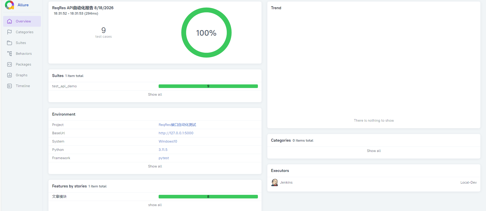
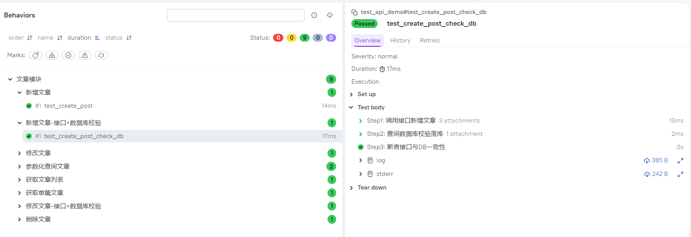
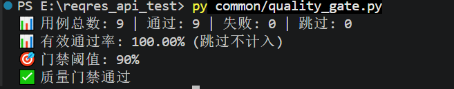

# ReqRes 接口自动化测试项目 

> 基于 Pytest + Requests + Allure 搭建**工程化数据驱动接口自动化测试框架**，从依赖外部 Mock 接口演进为**本地 Flask + SQLite 自研 Mock 服务**，实现零外部依赖、100% 稳定的接口自动化回归测试，支持业务链路串行依赖、接口+数据库双检、质量门禁自动阻断。

---

## ✨ 项目亮点

### V1：工程化框架（基于外部 API）
- ✅ 统一 HTTP 请求封装，集成 tenacity 自动重试，解决公网 Mock 接口网络抖动问题
- ✅ 工程化分层设计：公共工具层、测试数据层、业务用例层解耦，易维护、易扩展
- ✅ YAML 数据驱动：接口地址、请求参数、预期断言全部外置，新增用例无需改动 Python 脚本
- ✅ Pytest Fixture 实现**上下游接口参数传递**，支持完整业务链路串行测试
- ✅ Allure 可视化报告：支持 Feature/Story 业务模块划分、环境变量、多轮执行 Trend 趋势图
- ✅ 接入 GitHub Actions CI，代码 Push 自动触发回归，持续左移接口质量校验

### V2：本地 Mock + 质量门禁（当前）
- ✅ **自研 Flask + SQLite Mock 服务**，彻底消除外部 API 不稳定导致的 xfail/skip
- ✅ 核心 CRUD 9 用例 **100% 稳定通过**，零失败、零跳过
- ✅ **接口 + 数据库双检**：接口返回成功后，直连 SQLite 校验数据真实落库
- ✅ **质量门禁脚本**：Allure 结果通过率低于 90% 自动阻断 CI，防止低质量代码发布
- ✅ Allure 步骤拆解 + 请求/响应附件，单用例可追溯、可排查

---

## 🛠️ 技术栈

| 技术 | 说明 |
|------|------|
| Python 3.11 | 开发语言 |
| Pytest | 测试框架，Fixture 实现业务链路依赖 |
| Requests | HTTP 接口请求库 |
| Flask + SQLite | 本地 Mock 服务，零外部依赖 |
| Tenacity | 失败自动重试（V1 公网场景） |
| PyYAML | 读取 YAML 测试数据，实现数据驱动 |
| Allure | 可视化测试报告、步骤拆解、附件、趋势图 |
| GitHub Actions | CI 流水线，提交自动执行回归 |

---

## 📂 项目结构

```text
reqres_api_test/
├── assets/                    # 报告截图（README 展示用）
│   ├── v1/                    # V1 历史截图
│   └── v2/                    # V2 当前截图
├── cases/                     # V1 业务用例目录
│   ├── test_api_data_driven.py
│   ├── test_user_flow.py
│   └── test_user.py
├── common/                    # 公共工具层
│   ├── __init__.py
│   ├── mock_server.py         # ✅ Flask + SQLite 本地 Mock 服务
│   ├── quality_gate.py        # ✅ 质量门禁脚本
│   ├── db_util.py             # 数据库工具
│   ├── http_util.py           # 请求封装
│   ├── assert_util.py         # 断言封装
│   ├── log_util.py            # 日志封装
│   ├── request_util.py        # 请求工具
│   └── yaml_util.py           # YAML 读取
├── config/                    # 测试数据 yaml
│   └── test_data.yaml
├── conftest.py                # pytest 全局 fixture（含自动启停 Mock 服务）
├── test_api_demo.py           # ✅ V2 核心用例（CRUD + DB 双检）
├── pytest.ini                 # pytest 全局配置（已集成 alluredir）
├── requirements.txt           # 依赖清单
└── README.md
```

---

## ▶️ 本地运行（V2 版本）

### 1. 克隆项目
```bash
git clone https://github.com/StillStream-ink/reqres-api-pytest-allure.git
cd reqres-api-pytest-allure
```

### 2. 安装依赖
```bash
pip install -r requirements.txt
```

### 3. 执行测试（自动启停 Mock 服务）

`pytest.ini` 已配置 `--alluredir=allure-results`，直接运行：

```bash
# 执行 V2 核心用例
pytest test_api_demo.py

# 或执行全部用例（V1 + V2）
pytest
```

### 4. 质量门禁检查
```bash
python common/quality_gate.py
# 预期输出：✅ 质量门禁通过（通过率 100% > 阈值 90%）
```

### 5. 打开可视化报告
```bash
allure serve --name "ReqRes API自动化报告" ./allure-results
```

---

## 📊 效果预览

### V1：全量回归通过（22 用例 / 多模块）
基于 reqres.in 真实 API，覆盖用户/帖子/文章三大模块，集成 Jenkins 执行器。


### V1：多轮回归 Trend 趋势监控
前两轮全量通过，第三轮构造异常场景模拟缺陷，直观展示接口迭代质量波动。


### V2：本地 Mock 100% 通过（9 核心用例）
基于 Flask + SQLite 本地服务，零外部依赖，稳定 100% 通过。


### V2：接口 + 数据库双检（核心亮点）
Step1 调用接口 → Step2 查询数据库校验落库 → Step3 断言一致性，请求/响应/DB 记录全部附件留痕。


### V2：质量门禁自动通过
Allure 结果通过率统计，低于 90% 自动阻断 CI 流水线。


---

## 🎯 测试范围

### V2 核心用例（本地 Mock，根目录）

| 用例 | 类型 | 说明 |
|------|------|------|
| test_get_post_list | 查询 | GET 获取文章列表 |
| test_get_single_post | 查询 | GET 获取单篇文章（Fixture 动态 ID） |
| test_get_post_param | 查询 | 参数化查询不同 ID |
| test_create_post | 新增 | POST 新增文章 |
| test_update_post | 修改 | PUT 修改文章（Fixture 动态 ID） |
| test_delete_post | 删除 | DELETE 删除文章 + 验证 404 |
| test_create_post_check_db | 双检 | 新增接口 + SQLite 落库校验 |
| test_update_post_check_db | 双检 | 修改接口 + SQLite 落库校验 |

### V1 数据驱动用例（外部 API，cases/ 目录）
- GET 获取用户列表 / 单用户信息
- POST 用户登录 / 注册
- PUT 修改用户信息
- DELETE 删除用户
- 参数化查询不同用户 ID
- 业务链路：登录 → 获取用户信息 → 修改用户 → 删除用户

---

## 💡 踩坑记录

1. **JSONPlaceholder Mock 接口 POST 仅模拟成功，不持久化数据**，直接新增后查询会 404，导致大量 xfail。
   - **解决方案**：自研 Flask + SQLite 本地 Mock 服务，数据真实落库，彻底消除外部依赖。

2. **公网接口易网络抖动**，增加 tenacity 重试机制，减少偶发失败（V1 场景）。

3. **YAML 占位符替换**，实现链路上游返回值动态传给下游接口（V1 场景）。

4. **质量门禁脚本读取 Allure 结果时，旧结果未清理导致统计失真**。
   - **解决方案**：CI 流水线中每次构建前强制清理 `allure-results` 目录。

5. **SQLite 数据库路径因文件位置不同而错乱**（`common/mock_server.py` vs 根目录 `test_api_demo.py`）。
   - **解决方案**：统一使用项目根目录作为 DB 路径基准，避免 `__file__` 嵌套层级差异。

---

## 🚀 拓展方向（已完成 ✅ / 待办 ⬜）

- ✅ 自研本地 Mock 服务，消除外部 API 依赖
- ✅ 接口 + 数据库双向断言
- ✅ 通过率质量门禁，CI 不达标阻断发布
- ⬜ 失败用例自动截图 + 日志归档
- ⬜ 集成钉钉 / 企业微信消息推送
- ⬜ 扩展多环境切换（开发 / 测试 / 预发）
- ⬜ 接入 MySQL 真实数据库，替换 SQLite
