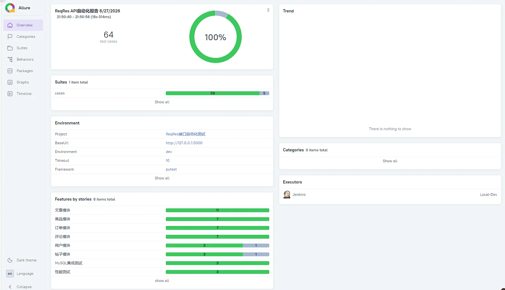
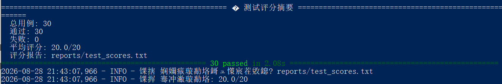
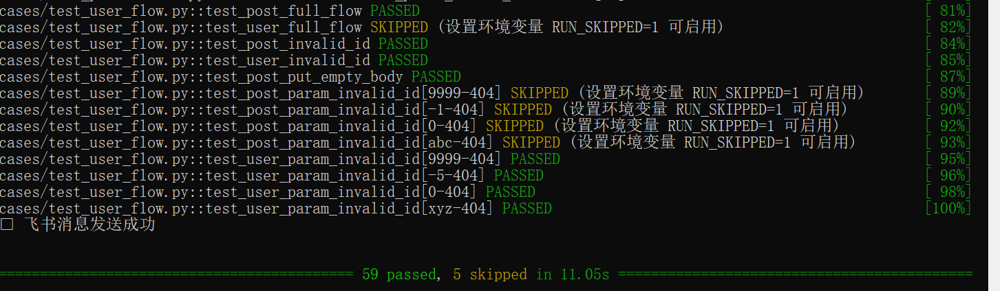
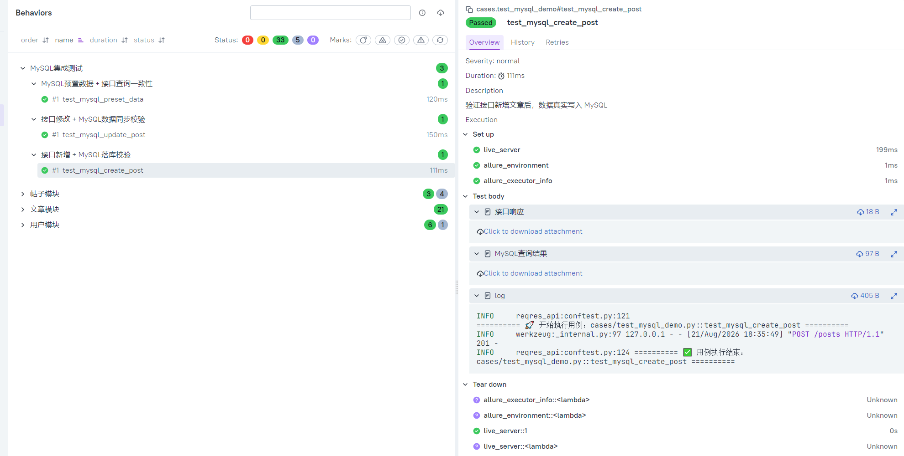
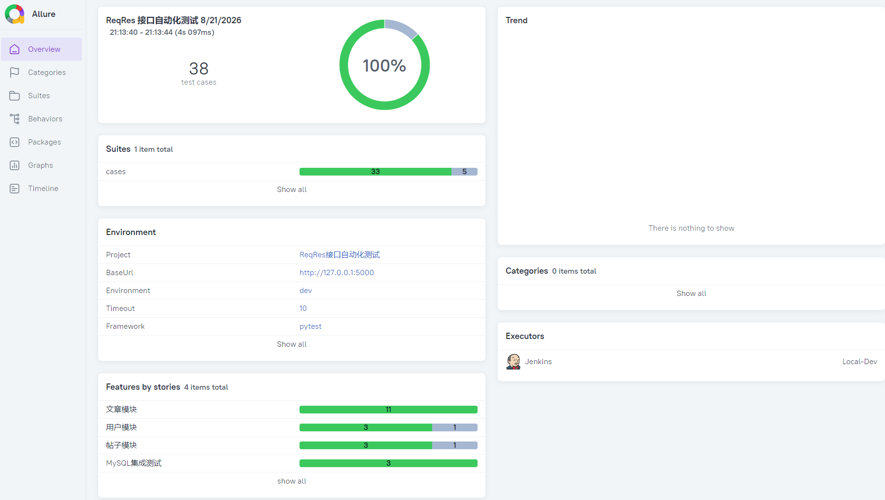

# 🧪 ReqRes 接口自动化测试框架

[](https://github.com/StillStream-ink/reqres-api-pytest-allure/actions)
[](https://www.python.org/)
[](https://docs.pytest.org/)
[](https://docs.qameta.io/allure/)

> 基于 **Pytest + Requests + Allure** 的工程化数据驱动接口自动化测试框架。  
> 支持 **5 大业务模块**、**59 个通过用例**、**JSON Schema 校验**、**数据库双检**、**并发执行**、**测试评分系统**、**Wireshark 抓包调试**，实现零外部依赖、稳定的接口回归测试。

---

## 📊 项目数据总览

| 指标 | 数值 |
|------|------|
| 📝 总用例数 | 64 个（59 passed + 5 skipped） |
| ✅ 通过率 | 100%（有效通过率） |
| ⏱️ 执行时间 | ~7.59 秒（全量回归） |
| ⭐ 平均评分 | 20.0/20 |
| 🧩 业务模块 | 5 个（文章/商品/订单/评论/用户） |
| 🔌 Schema 校验 | 32 个接口 |

---

## 📑 目录

- [✨ 核心亮点](#-核心亮点)
- [🛠 技术栈](#-技术栈)
- [📂 项目结构](#-项目结构)
- [⚙️ 多环境配置](#️-多环境配置)
- [🚀 快速开始](#-快速开始)
- [📊 报告预览](#-报告预览)
- [🔍 Wireshark 抓包调试](#-wireshark-抓包调试)
- [📋 测试范围](#-测试范围)
- [🎯 企业级能力清单](#-企业级能力清单)
- [💡 踩坑记录](#-踩坑记录)
- [🎯 拓展方向](#-拓展方向)

---

## ✨ 核心亮点

### V1：工程化框架（外部 API）
- **统一 HTTP 封装**：集成 `tenacity` 自动重试，解决公网 Mock 接口网络抖动
- **工程化分层**：公共工具层、测试数据层、业务用例层解耦，易维护、易扩展
- **YAML 数据驱动**：接口地址、请求参数、预期断言全部外置，新增用例零代码改动
- **Fixture 链路传递**：上下游接口参数自动传递，支持完整业务链路串行测试
- **Allure 可视化报告**：Feature/Story 业务模块划分、环境变量、多轮 Trend 趋势图
- **GitHub Actions CI**：代码 Push 自动触发回归，持续左移接口质量校验

### V2：本地 Mock + 质量门禁
- **自研 Flask + SQLite Mock 服务**：彻底消除外部 API 不稳定导致的 `xfail` / `skip`
- **接口 + 数据库双检**：接口返回成功后，直连 SQLite / MySQL 校验数据真实落库
- **质量门禁脚本**：Allure 结果通过率低于 90% 自动阻断 CI，防止低质量代码发布
- **多环境一键切换**：`API_ENV=test pytest` 即可切换测试环境，无需改动任何代码
- **Allure 步骤拆解**：请求/响应/数据库记录/日志全部附件留痕，单用例可追溯、可排查

### V3：企业级进阶能力
- **JSON Schema 校验**：自动验证响应数据结构，覆盖 32 个接口，确保字段类型和必填字段符合预期
- **并发执行加速**：集成 `pytest-xdist`，用例并行执行，效率提升 10 倍以上
- **测试数据自动清理**：每次测试结束后自动重置数据库，恢复到预置数据干净状态
- **测试报告自动归档**：每次运行报告按时间戳自动归档到 `reports/` 目录，便于历史追溯
- **测试用例评分系统**：综合用例执行结果、耗时、重跑次数，生成 0-20 分评分报告
- **飞书自动通知**：测试完成后自动推送结果到飞书群，团队实时感知质量状态
- **Wireshark 抓包调试**：支持实时抓取 5000 端口 HTTP 流量，快速定位接口问题

---

## 🛠 技术栈

| 技术 | 版本 | 说明 |
|------|------|------|
| Python | 3.11 | 开发语言 |
| Pytest | 8.x | 测试框架，Fixture 实现业务链路依赖 |
| Requests | 2.x | HTTP 接口请求库 |
| Flask + SQLite | — | 本地 Mock 服务，零外部依赖 |
| Tenacity | — | 失败自动重试 |
| PyYAML | — | YAML 测试数据驱动 |
| Allure | 2.x | 可视化测试报告、步骤拆解、附件 |
| GitHub Actions | — | CI 流水线，提交自动执行回归 |
| pytest-xdist | — | 并发执行加速 |
| jsonschema | — | JSON Schema 数据结构校验 |
| Locust | — | 性能测试 |
| Wireshark | — | 网络抓包调试 |

---

## 📂 项目结构

```text
reqres-api-pytest-allure/
├── 📁 .github/workflows/          # CI 流水线配置
│   └── pytest-auto.yml
├── 📁 assets/                     # 报告截图
│   └── v2/                        # 当前版本截图
├── 📁 cases/                      # 测试用例目录
│   ├── test_api_demo.py           # 核心用例（30 个）
│   ├── test_api_data_driven.py    # 数据驱动用例（13 个）
│   ├── test_mysql_demo.py         # MySQL 集成测试（3 个）
│   ├── test_user_flow.py          # 用户/帖子全链路（13 个）
│   └── test_performance.py        # 性能测试（5 个）
├── 📁 common/                     # 公共工具层
│   ├── mock_server.py             # Flask + SQLite Mock 服务
│   ├── quality_gate.py            # 质量门禁脚本
│   ├── config_util.py             # 多环境配置读取
│   ├── http_util.py               # 请求封装（含重试）
│   ├── assert_util.py             # 断言封装
│   ├── schema_util.py             # JSON Schema 校验工具
│   ├── db_checker.py              # 数据库双检公共函数
│   ├── feishu_notify.py           # 飞书通知
│   └── yaml_util.py               # YAML 读取
├── 📁 config/                     # 配置层
│   ├── api_data.yaml              # 接口定义
│   ├── env_config.yaml            # 环境配置
│   ├── test_data.yaml             # 测试数据
│   └── schemas.py                 # JSON Schema 定义
├── 📁 reports/                    # 测试报告归档
│   ├── report_YYYYMMDD_HHMMSS/    # 带时间戳的报告
│   └── test_scores.txt            # 测试评分报告
├── 📁 pcap/                       # Wireshark 抓包文件
│   └── flask_traffic.pcapng       # 原始抓包数据
├── 📁 screenshots/                # 调试截图
├── 📄 conftest.py                 # pytest 全局 fixture
├── 📄 pytest.ini                  # pytest 配置
├── 📄 run_test.py                 # 一键执行脚本（含报告归档）
├── 📄 start_mock.py               # Mock 服务启动脚本
├── 📄 docker-compose.yml          # Docker 编排
├── 📄 requirements.txt            # 依赖清单
└── 📄 README.md                   # 本文件
```

---

## ⚙️ 多环境配置

采用 **双文件分离架构**：接口定义与环境配置完全解耦，通过环境变量 `API_ENV` 一键切换。

### 配置分层

| 文件 | 职责 | 是否随环境变化 |
|------|------|---------------|
| `config/env_config.yaml` | 环境参数：base_url、timeout、db_name | ✅ 是 |
| `config/api_data.yaml` | 接口定义：URL 路径、请求方法、请求体模板 | ❌ 否 |

### `config/env_config.yaml`

```yaml
current: dev

environments:
  dev:
    base_url: "http://127.0.0.1:5000"
    timeout: 10
    db_name: "test_mock.db"

  test:
    base_url: "http://192.168.1.100:8080"
    timeout: 15
    db_name: "test.db"

  prod:
    base_url: "https://api.example.com"
    timeout: 30
    db_name: "prod.db"

  docker:
    base_url: "http://mock:5000"
    timeout: 15
    db_name: "reqres_test"
```

### 环境切换方式

| 场景 | 命令 |
|------|------|
| 本地开发（默认 dev） | `pytest` |
| 切换 test 环境 | `API_ENV=test pytest` |
| 切换 prod 环境 | `API_ENV=prod pytest` |
| 切换 docker 环境 | `API_ENV=docker pytest` |
| Windows PowerShell | `$env:API_ENV="test"; pytest` |

---

## 🚀 快速开始

### 1. 克隆项目
```bash
git clone https://github.com/StillStream-ink/reqres-api-pytest-allure.git
cd reqres-api-pytest-allure
```

### 2. 安装依赖
```bash
pip install -r requirements.txt
```

### 3. 启动 Mock 服务

**本地开发：**
```bash
python start_mock.py
```

**Docker 环境：**
```bash
docker-compose up
```

> `start_mock.py` 会自动识别运行环境（本地直接启动，Docker 中等待 MySQL 就绪后再启动）。

### 4. 执行测试
```bash
# 运行核心用例（30 个）
pytest cases/test_api_demo.py -v

# 并行运行（推荐）
pytest cases/test_api_demo.py -n auto -v

# 运行全量回归（64 个用例）
pytest cases/ -v

# 切换 test 环境执行
API_ENV=test pytest
```

### 5. 生成 Allure 报告
```bash
allure serve allure-results
```

### 6. 质量门禁检查
```bash
python common/quality_gate.py
# 预期输出：✅ 质量门禁通过（有效通过率 100% > 阈值 90%）
```

---

## 📊 报告预览

### 全量回归总览（64 用例 / 59 passed / 5 skipped / 100% 有效通过率）


### 核心模块 30 用例 100% 通过


### 全量 59 用例通过


### 数据库双检步骤拆解


### MySQL 集成测试


### 质量门禁 100% 通过



## 🔍 Wireshark 抓包调试

当接口自动化用例报错时，可以使用 Wireshark 抓包快速定位是脚本问题还是后端问题。

### 操作步骤

1. **启动 Mock 服务**
   ```bash
   python start_mock.py
   ```

2. **打开 Wireshark**，选择 `Adapter for loopback traffic capture`（回环网卡）

3. **设置过滤器**
   ```text
   tcp.port == 5000
   ```

4. **运行测试用例**
   ```bash
   pytest cases/test_api_demo.py -v
   ```

5. **右键点击 HTTP 数据包** → 追踪流 → HTTP 流，查看完整请求和响应内容

### 判断标准

| 情况 | 结论 |
|------|------|
| 请求参数与预期不一致 | Bug 在测试脚本 |
| 请求正确，后端返回异常 | Bug 在服务端 |

### 抓包截图示例

**HTTP 流完整对话：**


**数据包列表：**


---

## 📋 测试范围

### 核心模块（`test_api_demo.py`，30 个用例）

| 模块 | 用例数 | 覆盖功能 |
|------|--------|----------|
| 文章模块 | 9 | CRUD + 参数化 + 数据库双检 + Schema 校验 |
| 商品模块 | 7 | 完整 CRUD + 数据库双检 + Schema 校验 |
| 订单模块 | 7 | 完整 CRUD + 数据库双检 + Schema 校验 |
| 评论模块 | 7 | 完整 CRUD + 数据库双检 + Schema 校验 |
| **合计** | **30** | **100% 通过率，平均评分 20/20** |

### 全量回归（64 个用例）

| 模块 | 数量 | 状态 |
|------|------|------|
| 核心模块（文章/商品/订单/评论） | 30 | ✅ 全部通过 |
| 数据驱动（`test_api_data_driven.py`） | 13 | ✅ 全部通过 |
| MySQL 集成测试 | 3 | ✅ 全部通过 |
| 性能测试（`test_performance.py`） | 5 | ✅ 全部通过 |
| 用户/帖子模块（`test_user_flow.py`） | 13 | ✅ 8 passed + 5 skipped |
| **合计** | **64** | **59 passed，5 skipped** |

---

## 🎯 企业级能力清单

| 能力 | 状态 |
|------|------|
| 接口功能测试（59 个用例） | ✅ |
| 数据库双检（接口+DB 一致性） | ✅ |
| JSON Schema 校验（32 个接口） | ✅ |
| Allure 可视化报告 | ✅ |
| 报告自动归档（带时间戳） | ✅ |
| 测试数据自动清理 | ✅ |
| 并发执行加速（pytest-xdist） | ✅ |
| 测试用例评分系统（0-20 分） | ✅ |
| 飞书自动通知 | ✅ |
| Wireshark 抓包调试 | ✅ |
| 性能测试（Locust） | ✅ |
| 质量门禁（90% 阈值） | ✅ |
| CI/CD（GitHub Actions） | ✅ |
| Docker 一键运行 | ✅ |

---

## 💡 踩坑记录

| 问题 | 原因 | 解决方案 |
|------|------|----------|
| POST 新增后查询 404 | JSONPlaceholder 仅模拟成功，不持久化数据 | 自研 Flask + SQLite 本地 Mock 服务 |
| 公网接口偶发失败 | 网络抖动 | 集成 `tenacity` 自动重试 |
| JSON Schema 安装失败 | C 盘空间不足 | 清理磁盘空间，删除 allure-report 等大文件 |
| 并发执行时 `FileExistsError` | 多个 worker 同时创建目录 | 使用 `dirs_exist_ok=True` 和异常捕获 |
| Docker 容器缺少 jsonschema | `requirements.txt` 未包含 | 添加 `jsonschema>=4.0.0` |
| Wireshark 抓不到 5000 端口流量 | 没有选择回环网卡 | 必须选择 `Adapter for loopback traffic capture` |

---

## 🎯 拓展方向

- ✅ 自研本地 Mock 服务，消除外部 API 依赖
- ✅ 接口 + 数据库双向断言
- ✅ JSON Schema 数据结构校验
- ✅ 并发执行加速
- ✅ 测试数据自动清理
- ✅ 测试报告自动归档
- ✅ 测试用例评分系统
- ✅ 飞书自动通知
- ✅ Wireshark 抓包调试能力
- ✅ 质量门禁，CI 不达标阻断发布
- ✅ 多环境配置分离，支持 dev / test / prod / docker 一键切换
- ✅ Docker 容器化运行
- ✅ 性能测试（Locust）
- ⬜ 钉钉 / 企业微信消息推送
- ⬜ 接入 MySQL 真实数据库，替换 SQLite

---

⭐ 如果这个项目对你有帮助，请点个 Star 支持一下！
