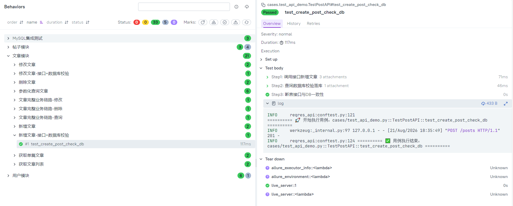
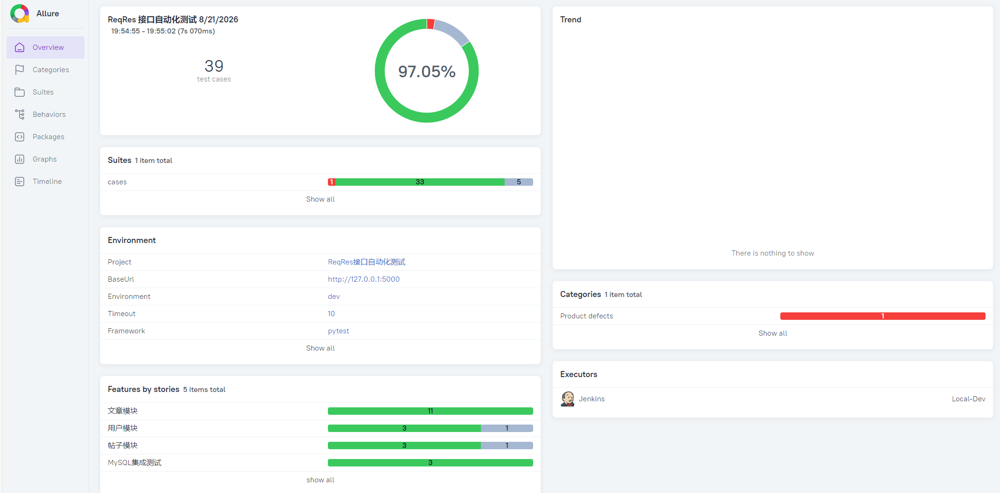

# 🧪 ReqRes 接口自动化测试框架

[](https://github.com/StillStream-ink/reqres-api-pytest-allure/actions)
[](https://www.python.org/)
[](https://docs.pytest.org/)
[](https://docs.qameta.io/allure/)

> 基于 **Pytest + Requests + Allure** 的工程化数据驱动接口自动化框架。  
> 从依赖外部 Mock 接口演进为 **本地 Flask + SQLite 自研 Mock 服务**，实现零外部依赖、稳定的接口回归测试。

---

## 📑 目录

- [✨ 核心亮点](#-核心亮点)
- [🛠 技术栈](#-技术栈)
- [📂 项目结构](#-项目结构)
- [⚙️ 多环境配置](#️-多环境配置)
- [🚀 快速开始](#-快速开始)
- [📊 报告预览](#-报告预览)
- [📋 测试范围](#-测试范围)
- [💡 踩坑记录](#-踩坑记录)
- [🎯 拓展方向](#-拓展方向)

---

## ✨ 核心亮点

### V1：工程化框架（外部 API）
- **统一 HTTP 封装**：集成 `tenacity` 自动重试，解决公网 Mock 接口网络抖动
- **工程化分层**：公共工具层、测试数据层、业务用例层解耦，易维护、易扩展
- **YAML 数据驱动**：接口地址、请求参数、预期断言全部外置，新增用例零代码改动
- **Fixture 链路传递**：上下游接口参数自动传递，支持完整业务链路串行测试
- **Allure 可视化报告**：Feature/Story 业务模块划分、环境变量、多轮 Trend 趋势图
- **GitHub Actions CI**：代码 Push 自动触发回归，持续左移接口质量校验

### V2：本地 Mock + 质量门禁（当前）
- **自研 Flask + SQLite Mock 服务**：彻底消除外部 API 不稳定导致的 `xfail` / `skip`
- **接口 + 数据库双检**：接口返回成功后，直连 SQLite / MySQL 校验数据真实落库
- **质量门禁脚本**：Allure 结果通过率低于 90% 自动阻断 CI，防止低质量代码发布
- **多环境一键切换**：`API_ENV=test pytest` 即可切换测试环境，无需改动任何代码
- **Allure 步骤拆解**：请求/响应/数据库记录/日志全部附件留痕，单用例可追溯、可排查

---

## 🛠 技术栈

| 技术 | 版本 | 说明 |
|------|------|------|
| Python | 3.11 | 开发语言 |
| Pytest | 8.x | 测试框架，Fixture 实现业务链路依赖 |
| Requests | 2.x | HTTP 接口请求库 |
| Flask + SQLite | — | 本地 Mock 服务，零外部依赖 |
| Tenacity | — | 失败自动重试（V1 公网场景） |
| PyYAML | — | YAML 测试数据驱动 |
| Allure | 2.x | 可视化测试报告、步骤拆解、附件 |
| GitHub Actions | — | CI 流水线，提交自动执行回归 |

---

## 📂 项目结构

```text
reqres-api-pytest-allure/
├── 📁 .github/workflows/          # CI 流水线配置
│   ├── api_test.yml
│   └── pytest-auto.yml
├── 📁 assets/                     # 报告截图（README 展示用）
│   ├── v1/                        # V1 历史截图
│   └── v2/                        # V2 当前截图
├── 📁 cases/                      # V1 业务用例目录（外部 API）
│   ├── test_api_data_driven.py
│   ├── test_user_flow.py
│   └── test_user.py
├── 📁 common/                     # 公共工具层
│   ├── mock_server.py             # ✅ Flask + SQLite 本地 Mock 服务
│   ├── quality_gate.py            # ✅ 质量门禁脚本
│   ├── config_util.py             # ✅ 多环境配置统一读取
│   ├── db_util.py                 # 数据库工具
│   ├── http_util.py               # 请求封装
│   ├── assert_util.py             # 断言封装
│   ├── log_util.py                # 日志封装
│   ├── request_util.py            # 请求工具
│   └── yaml_util.py               # YAML 读取
├── 📁 config/                     # 配置层（接口定义 + 环境配置分离）
│   ├── api_data.yaml              # 接口定义：URL、方法、请求模板、预期状态码
│   ├── env_config.yaml            # 环境配置：base_url、timeout、db_name 等
│   └── test_data.yaml             # 测试数据
├── 📄 conftest.py                 # pytest 全局 fixture（自动启停 Mock 服务）
├── 📄 test_api_demo.py            # ✅ V2 核心用例（CRUD + DB 双检）
├── 📄 pytest.ini                  # pytest 全局配置
├── 📄 run_test.py                 # 一键执行脚本（pytest → 生成报告 → 自动打开）
├── 📄 requirements.txt            # 依赖清单
└── 📄 README.md                   # 本文件
```

---

## ⚙️ 多环境配置

采用 **双文件分离架构**：接口定义与环境配置完全解耦，通过环境变量 `API_ENV` 一键切换。

### 配置分层

| 文件 | 职责 | 是否随环境变化 |
|------|------|---------------|
| `config/env_config.yaml` | 环境参数：base_url、timeout、db_name | ✅ 是 |
| `config/api_data.yaml` | 接口定义：URL 路径、请求方法、请求体模板 | ❌ 否 |

### `config/env_config.yaml`

```yaml
current: dev   # 默认环境，可被 API_ENV 环境变量覆盖

environments:
  dev:
    base_url: "http://127.0.0.1:5000"
    timeout: 10
    db_name: "test_mock.db"
    env_name: "dev"

  test:
    base_url: "http://192.168.1.100:8080"
    timeout: 15
    db_name: "test.db"
    env_name: "test"

  prod:
    base_url: "https://api.example.com"
    timeout: 30
    db_name: "prod.db"
    env_name: "prod"
```

### `config/api_data.yaml`（保持现有结构，零改动）

```yaml
posts_list:
  url: "/posts"
  method: "GET"
  expect_code: 200

posts_detail:
  url: "/posts/{post_id}"
  method: "GET"
  expect_code: 200

posts_create:
  url: "/posts"
  method: "POST"
  json:
    title: "test title"
    body: "test body"
    userId: 1
  expect_code: 201
```

### 环境切换方式

| 场景 | 命令 |
|------|------|
| 本地开发（默认 dev） | `pytest` |
| 切换 test 环境 | `API_ENV=test pytest` |
| 切换 prod 环境 | `API_ENV=prod pytest` |
| Windows PowerShell | `$env:API_ENV="test"; pytest` |

`common/config_util.py` 统一读取：自动加载对应环境配置，拼接完整 URL，替换路径参数。

---

## 🚀 快速开始

### 1. 克隆项目
```bash
git clone https://github.com/StillStream-ink/reqres-api-pytest-allure.git
cd reqres-api-pytest-allure
```

### 2. 安装依赖
```bash
pip install -r requirements.txt
```

### 3. 执行测试

`pytest.ini` 已配置 `--alluredir=allure-results`，直接运行：

```bash
# 执行 V2 核心用例（默认 dev 环境，自动启停 Mock 服务）
pytest test_api_demo.py

# 执行全部用例（V1 + V2）
pytest

# 切换 test 环境执行（V1 外部 API 用例，不启动 Mock）
API_ENV=test pytest
```

### 4. 一键生成报告（推荐）
```bash
python run_test.py
```

或手动执行：

```bash
# 生成报告并指定标题
allure generate allure-results -o allure-report --clean --name "ReqRes 接口自动化测试报告"

# 本地预览
allure serve --name "ReqRes 接口自动化测试报告" ./allure-results
```

### 5. 质量门禁检查
```bash
python common/quality_gate.py
# 预期输出：✅ 质量门禁通过（有效通过率 100% > 阈值 90%）
```

---

## 📊 报告预览

### 全量回归概览（38 用例 / 4 大模块 / 100% 有效通过率）
基于 Flask + SQLite 本地服务 + 外部 API 混合执行，环境信息、模块分布、执行者信息一目了然。  
（V1 外部 API 用例在 dev 环境自动跳过，不计入通过率统计）


### 业务模块覆盖 + SQLite 数据库双检
左侧：文章模块 21 条用例全展开，覆盖 CRUD、参数化查询、业务链路、接口+数据库校验。  
右侧：`test_create_post_check_db` 三步拆解：调接口 → 查 SQLite 落库 → 断言一致性，附件与日志留痕。



### MySQL 真实数据库集成测试
独立 MySQL 集成测试模块，3 条用例覆盖预置数据查询、新增落库、修改同步。  
右侧：`test_mysql_create_post` 验证接口新增后数据真实写入 MySQL，接口响应与查询结果附件留痕。


### 质量门禁：通过 & 缺陷感知双场景

| 场景 | 截图 | 说明 |
|------|------|------|
| 日常回归（38 条全通过） |  | 有效通过率 100%，CI 自动放行 |
| 构造缺陷（39 条含 1 失败） |  | 模拟接口异常，Allure 自动标记 Product defects，有效通过率 97.06% 仍高于 90% 阈值 |

---

## 📋 测试范围

### V2 核心用例（本地 Mock，根目录 `test_api_demo.py`）

| 用例 | 类型 | 说明 |
|------|------|------|
| `test_get_post_list` | 查询 | GET 获取文章列表 |
| `test_get_single_post` | 查询 | GET 获取单篇文章（Fixture 动态 ID） |
| `test_get_post_param` | 查询 | 参数化查询不同 ID |
| `test_create_post` | 新增 | POST 新增文章 |
| `test_update_post` | 修改 | PUT 修改文章（Fixture 动态 ID） |
| `test_delete_post` | 删除 | DELETE 删除文章 + 验证 404 |
| `test_create_post_check_db` | 双检 | 新增接口 + SQLite 落库校验 |
| `test_update_post_check_db` | 双检 | 修改接口 + SQLite 落库校验 |

### V1 数据驱动用例（外部 API / 本地 Mock，`cases/` 目录）

| 模块 | 数量 | 说明 |
|------|------|------|
| 文章模块 | 11 | GET 列表 / 单篇、POST 新增、PUT 修改、DELETE 删除、参数化查询、业务链路 |
| 用户模块 | 4 | GET 用户列表 / 单用户、POST 登录 / 注册（dev 环境外部 API 用例自动跳过） |
| 帖子模块 | 4 | GET 帖子列表 / 单帖子、POST 新增、PUT 修改（dev 环境外部 API 用例自动跳过） |
| MySQL 集成测试 | 3 | 接口 + 数据库双向断言（预置数据查询、新增落库、修改同步） |
| 业务链路 | 3+ | 登录 → 获取用户信息 → 修改用户 → 删除用户（Fixture 串行依赖） |
| **合计** | **38** | 33 通过 / 5 跳过（跳过不计入质量门禁） |

> **关于 Skip**：V1 外部 API 用例在 `dev` 环境因 JSONPlaceholder 数据不持久化而自动跳过，不影响质量门禁统计。  
> **关于 97% 截图**：为演示质量门禁对缺陷的感知能力，额外构造 1 条失败用例（39 条），Allure 自动归类为 Product defects，有效通过率 97.06% 仍高于 90% 阈值，日常回归均为 38 条 100% 通过。

---

## 💡 踩坑记录

| 问题 | 原因 | 解决方案 |
|------|------|----------|
| **POST 新增后查询 404** | JSONPlaceholder 仅模拟成功，不持久化数据 | 自研 Flask + SQLite 本地 Mock 服务，数据真实落库 |
| **公网接口偶发失败** | 网络抖动 | 集成 `tenacity` 自动重试机制（V1 场景） |
| **YAML 占位符未替换** | 链路上下游参数传递失败 | 实现动态占位符替换，上游返回值自动注入下游 |
| **质量门禁统计失真** | 旧 `allure-results` 未清理 | CI 流水线每次构建前强制清理结果目录 |
| **SQLite 路径错乱** | `common/mock_server.py` 与根目录执行路径不一致 | 统一以项目根目录为 DB 路径基准，避免 `__file__` 嵌套差异 |
| **环境切换需改代码** | 早期 base_url 硬编码在 Python 中 | 抽离 `env_config.yaml`，通过 `API_ENV` 环境变量一键切换 |

---

## 🎯 拓展方向

- ✅ 自研本地 Mock 服务，消除外部 API 依赖
- ✅ 接口 + 数据库双向断言
- ✅ 通过率质量门禁，CI 不达标阻断发布
- ✅ 多环境配置分离，支持 dev / test / prod 一键切换
- ⬜ 失败用例自动截图 + 日志归档
- ⬜ 集成钉钉 / 企业微信消息推送
- ⬜ 接入 MySQL 真实数据库，替换 SQLite
